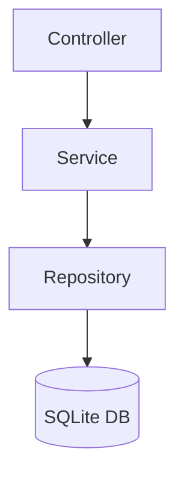
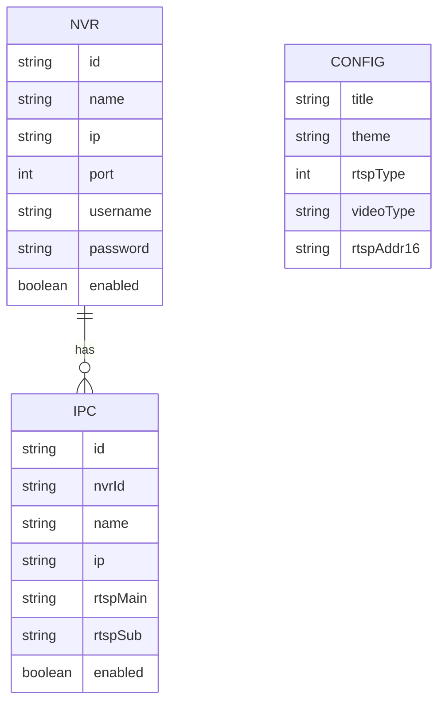

## 1. Architecture Design


## 2. Technology Description
- **Frontend**: React@18 + TypeScript + tailwindcss@3 + vite
- **Initialization Tool**: vite-init
- **Backend**: Express@4 + TypeScript
- **Database**: SQLite (存储设备配置和系统设置)
- **Video Streaming**: 使用 HTML5 video 标签播放 RTSP 流（通过中间件转换为 HLS）

## 3. Route Definitions
| Route | Purpose |
|-------|---------|
| / | 主监控页面 |
| /devices | 设备管理页面 |
| /config | 系统配置页面 |
| /polling | 轮询配置页面 |

## 4. API Definitions
### 4.1 Type Definitions
```typescript
// NVR设备
interface NVR {
  id: string;
  name: string;
  ip: string;
  port: number;
  username: string;
  password: string;
  enabled: boolean;
}

// IPC设备
interface IPC {
  id: string;
  nvrId: string;
  name: string;
  ip: string;
  rtspMain: string;
  rtspSub: string;
  enabled: boolean;
}

// 系统配置
interface Config {
  title: string;
  theme: string;
  rtspType: number; // 0: 主码流, 1: 子码流
  videoType: string; // 1, 1_4, 5_8, 9_12, 13_16, 1_9, 8_16, 16
  rtspAddr16: string;
}

// 轮询配置
interface PollingConfig {
  enabled: boolean;
  interval: number;
  channels: number[];
}
```

### 4.2 API Endpoints
- `GET /api/nvrs` - 获取所有NVR设备
- `POST /api/nvrs` - 创建NVR设备
- `PUT /api/nvrs/:id` - 更新NVR设备
- `DELETE /api/nvrs/:id` - 删除NVR设备
- `GET /api/ipcs` - 获取所有IPC设备
- `POST /api/ipcs` - 创建IPC设备
- `PUT /api/ipcs/:id` - 更新IPC设备
- `DELETE /api/ipcs/:id` - 删除IPC设备
- `GET /api/config` - 获取系统配置
- `PUT /api/config` - 更新系统配置
- `GET /api/polling` - 获取轮询配置
- `PUT /api/polling` - 更新轮询配置

## 5. Server Architecture Diagram


## 6. Data Model

### 6.1 Data Model Definition


### 6.2 Data Definition Language
```sql
-- NVR表
CREATE TABLE IF NOT EXISTS NVRInfo (
    NVRID TEXT PRIMARY KEY,
    NVRName TEXT,
    NVRIP TEXT,
    NVRPort INTEGER,
    NVRUsername TEXT,
    NVRPassword TEXT,
    NVRUse TEXT
);

-- IPC表
CREATE TABLE IF NOT EXISTS IPCInfo (
    IPCID TEXT PRIMARY KEY,
    NVRID TEXT,
    IPCName TEXT,
    IPCIP TEXT,
    IPCRtspAddrMain TEXT,
    IPCRtspAddrSub TEXT,
    IPCUse TEXT
);

-- 配置表
CREATE TABLE IF NOT EXISTS Config (
    Key TEXT PRIMARY KEY,
    Value TEXT
);
```

