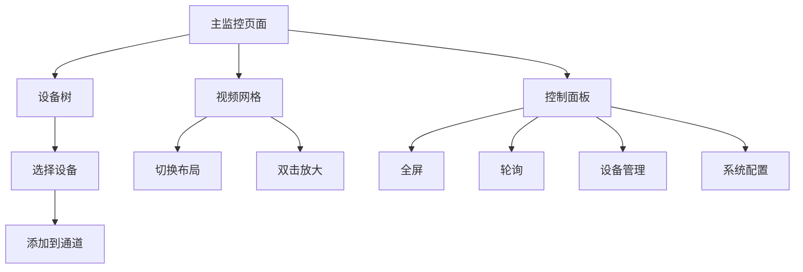

## 1. Product Overview
网页版智能视频监控客户端，提供多通道视频监控、设备管理、画面布局切换等功能，替代传统Qt桌面应用。

## 2. Core Features

### 2.1 Feature Module
1. **主监控页面**: 16通道视频网格、设备树导航、控制面板
2. **设备管理页面**: NVR和IPC设备的增删改查
3. **配置页面**: 系统参数配置
4. **轮询配置页面**: 视频轮询设置

### 2.3 Page Details
| Page Name | Module Name | Feature description |
|-----------|-------------|---------------------|
| 主监控页面 | 视频网格 | 支持1/4/9/16画面布局切换，双击放大单个画面 |
| 主监控页面 | 设备树导航 | 树形结构展示NVR和IPC设备，可拖拽或双击添加到通道 |
| 主监控页面 | 控制面板 | 全屏、轮询、设备管理、配置等功能按钮 |
| 设备管理页面 | NVR管理 | 添加、编辑、删除NVR设备 |
| 设备管理页面 | IPC管理 | 添加、编辑、删除IPC设备 |
| 配置页面 | 系统配置 | 系统标题、主题、码流类型等配置 |
| 轮询配置页面 | 轮询设置 | 设置轮询间隔、轮询通道等 |

## 3. Core Process
用户登录系统 → 查看设备树 → 选择设备添加到视频通道 → 切换不同画面布局 → 进行截图、录像等操作

## 4. User Interface Design
### 4.1 Design Style
- **Primary Colors**: 深蓝色 (#1e3a5f) 和青色 (#00bcd4)
- **Secondary Colors**: 灰色 (#f5f7fa) 和深灰 (#2c3e50)
- **Button Style**: 圆角矩形，有hover效果和点击反馈
- **Font**: Noto Sans SC, 14px主要文本, 16px标题
- **Layout**: 左右分栏布局，左侧设备树，右侧视频网格+顶部控制栏
- **Icon Style**: 使用Lucide图标库，简洁现代

### 4.2 Page Design Overview
| Page Name | Module Name | UI Elements |
|-----------|-------------|-------------|
| 主监控页面 | 视频网格 | 深色背景，带边框的视频容器，hover时有发光效果 |
| 主监控页面 | 设备树 | 树形组件，支持展开/折叠，设备图标 |
| 主监控页面 | 控制面板 | 顶部导航栏，图标+文字按钮 |
| 设备管理页面 | 设备列表 | 卡片式布局，编辑/删除按钮 |

### 4.3 Responsiveness
- Desktop-first设计
- 支持响应式布局，适配不同屏幕尺寸
- 触摸优化，支持移动端操作

